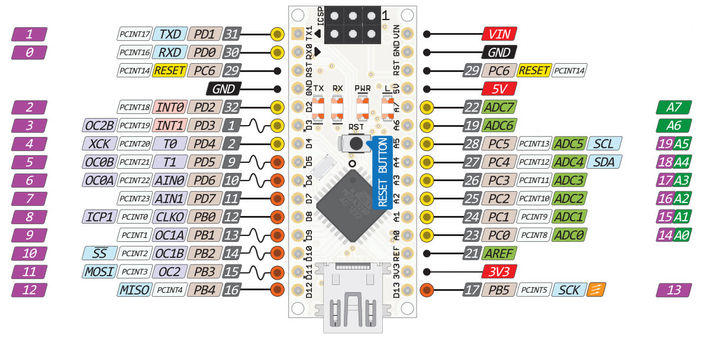

# Garage Distance Sensor

Distance sensor hooked up to a relay which turns on and off LED light in order to notfy the driver that car is close enough to the wall.

## Equipment used

- Arduino nano

- Relay

- Ultrasonic Sensor HC-SR04 (distance sensor)

- Wires

## Pins

| Pin | Comment                                                                                           |
| --- | ------------------------------------------------------------------------------------------------- |
| 8   | Trigger pin on distance sensor *(it had to be reversed with echo pin as my component was faulty)* |
| 10  | Echopin on distance sensor *(it had to be reversed with trigger pin as my component was faulty)*  |
| 9   | Pin to control the relay                                                                          |

## References

